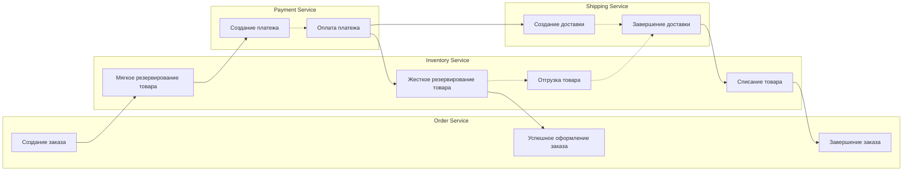

```mermaid
flowchart LR
  %% Services (без БД)
  subgraph OS[Order Service]
    OS1[Создание заказа]
    OS2[Успешное оформление заказа]
    OS3[Завершение заказа]
  end

  subgraph IS[Inventory Service]
    IS1[Мягкое резервирование товара]
    IS2[Жесткое резервирование товара]
    IS3[Отгрузка товара]
    IS4[Списание товара]
  end

  subgraph PS[Payment Service]
    PS1[Создание платежа]
    PS2[Оплата платежа]
  end

  subgraph SS[Shipping Service]
    SS1[Создание доставки]
    SS2[Завершение доставки]
  end

  %% Транзакция 1 (сплошные)
  OS1 --> IS1 --> PS1

  %% Переход к следующей транзакции (пунктир)
  PS1 -.-> PS2

  %% Транзакция 2 (сплошные)
  PS2 --> SS1
  PS2 --> IS2 --> OS2

  %% Переход к следующей транзакции (пунктир)
  IS2 -.-> IS3
  SS1 -.-> SS2

  %% Транзакция 3 (сплошные)
  SS2 --> IS4 --> OS3

  %% Доп. пунктир как на схеме (отгрузка -> завершение доставки)
  IS3 -.-> SS2

```